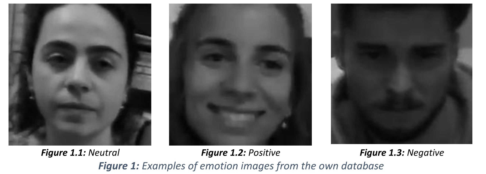
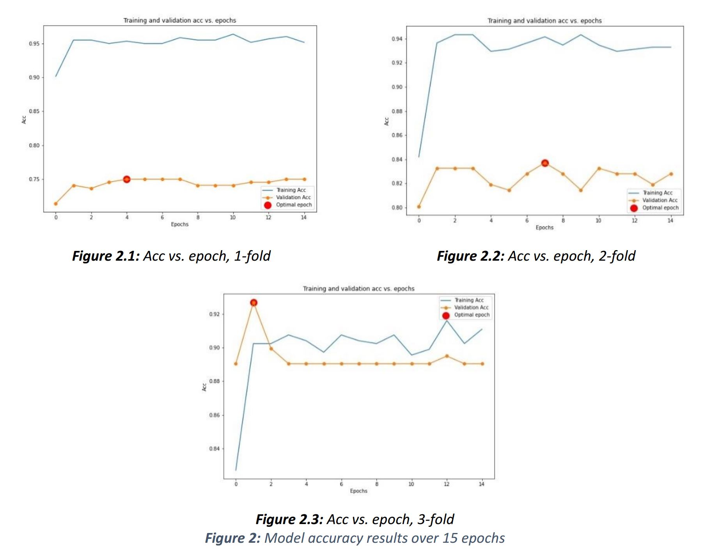

# Interpreting human emotional responses from real-time video capture
The developed interface is part of the COMPANION-CM project [1], which aims to create more social assistive robots. One of the keys to achieving this goal is for these machines to be able to interpret and act in response to human responses generated by the robot's own actions. 

Convolutional Neural Networks (CNN) are used to carry out this part of the robot's AI, in order to extract features from video recordings. As for the training of the CNN, it is carried out with relevant training data, such as the AffectNet database [2], achieving a robust feature extraction system. AffectNet contains about 1 million facial images collected from the Internet, making it one of the largest databases of facial expressions in existence. In it, up to eleven categorical labels of emotions and non-emotions can be distinguished (Neutral, Happiness, Sadness, Surprise, Fear, Disgust, Anger, Contempt, None, Uncertainty, Faceless).

For our problem, it is not necessary to differentiate such specific emotions, but rather it is sufficient to differentiate three types of categories: positive, negative and neutral. What we are really interested in is whether the action that the robot has decided to perform is well received or not by the user. For example, what does it mean to express happiness as a response to an action, under our criteria, we understand and classify the emotion happiness as a positive response. Following this criterion, we relabelled the AffectNet database and created an additional one in order to adjust the model to the user it is currently assisting. In this way, the pre-trained model is finely tuned to the expressions of the actual patient and his or her environment, making it more effective in the context of application. 

# Table of contents
- [Dependencies](#Dependencies)
- [Project Structure](#Project-Structure)
- [Usage](#Usage)
    - [Simple Usage](#Simple-Usage)
    - [Advanced Usage](#Advanced-Usage)
- [Datasets](#Datasets)
- [Data preparation](#Data-preparation)
- [Results](#Results)
- [References](#References)

# Dependencies
To install the required packages, run ``pip install -r requirements.txt``
# Project Structure

    Interpreting-human-emotional-responses-from-real-time-video-capture/                               
    ├── AffectNet_relabelled
    │  ├── positive
    │  ├── negative
    │  └── neutral
    ├── 3-fold
    │   ├── 1fold
    │   │   ├── train
    │   │   │  ├── positive
    │   │   │  ├── negative
    │   │   │  └── neutral
    │   │   └──  test
    │   │   │  ├── positive
    │   │   │  ├── negative
    │   │   │  └── neutral
    │   ├── 2fold
    │   │   ├── train
    │   │   │  ├── positive
    │   │   │  ├── negative
    │   │   │  └── neutral
    │   │   └──  test
    │   │   │  ├── positive
    │   │   │  ├── negative
    │   │   │  └── neutral
    │   └──  3fold
    │   │   ├── train
    │   │   │  ├── positive
    │   │   │  ├── negative
    │   │   │  └── neutral
    │   │   └──  test
    │   │   │  ├── positive
    │   │   │  ├── negative
    │   │   │  └── neutral
    ├── classifier
    │   ├── haarcascade_eye
    │   └── haarcascade_frontalface_default
    ├── pretrained_models
    │   ├── model_display_1.pt
    │   ├── model_display_2.pt
    │   ├── model_display_3.pt
    │   └── model_finetunning.pt
    ├── weak_loss_layer
    │   └── weak_loss.py
    ├── config.py
    ├── dataset_creation.py
    ├── emotions.py
    ├── evaluation.py
    ├── LICENSE
    └── README.md

# Usage
To be able to use this emotion detection system, you must first download this repository and install the dependencies if necessary.

``
git clone https://github.com/SilviaAbal/Interpreting-human-emotional-responses-from-real-time-video-capture.git
``

The implemented code allows to fine-tuning the model if desired or to use the system in real time using a webcam with a pre-trained model.

The idea of tuning the model is to make it work better with the people the robot is assisting, hence the decision to create its own database. If a user finds it necessary to adjust the model to work better with the people he/she considers, he/she has the possibility to adjust the model using the "train" option. To do this, the hierarchy and syntax of the files must be taken into account. Similarly, you can make use of our own database with permission. It should be noted that we use a very small percentage of the images from the AffectNet database to adjust the model in order to avoid a possible overfitting of the model to our own images.

## Simple Usage
- To train the model:

    ``
    python emotions.py --mode train
    ``

- To detect human reactions in real time:

    ``
    python emotions.py --mode display
    ``
## Advanced Usage

Only for the ``--mode train`` option. The model can be retrained with the default parameters, as in the example above, or the following variables can be specified by command line: 

     --num_epoch (int)                  # Number of epochs for training the network
     --batch size (int)                 # Batch size for the training of the network
     --lr (float)                       # Learning rate
     --gamma (float)                    # Discount rate of future rewards
     --percentage (float)               # Percentage of AffectNet images used for finetunning the model [0,100]
     --weight_decay (float)             # L2 regularization method
     --results_per_person (boolean)     # Display the results obtained per person identified in the dataset
     --pretrained_model_display (int)   # Selection of pretrained model used (1,2,3)

<b> Example </b>

 ``
    python emotions.py --mode train --batch_size 23
    ``

> The default parameters are specified in the file "config.py".

# Datasets
Two different databases have been used to implement this system: 

- <b> AffectNet Dataset: </b>

    In a first stage, for the creation of the main model the AffectNet Database has been used. A reduced version has been used with only 8 tags: Neutral, Happiness, Sadness, Surprise, Fear, Disgust, Anger, Contempt. AffecNet-8 includes 291,650 images, divided by the authors themselves into 287,651 training samples and 3,999 validation samples. 

    In this paper we will use the images corresponding to the categorical labels of all available emotions except for the category surprise. This is due to its ambiguity in giving it a more generic meaning. We consider that this emotion can carry both a positive and a negative meaning as a response to an action, so it has been decided to dispense with all of these samples. As for the other categories, we have redefined them as follows: positive emotion: happiness; neutral: neutral; negative: sadness, fear, disgust, anger and contempt. 

    So, finally, we have a total of 277,060 samples, of which 75,374 images correspond to the neutral category, 134,915 to the positive category and, finally, 66,771 to the negative category.
    
    This database has also been used in the last stage of the implementation of the final system, but not in its entirety, only 0.05% of the total number of samples has been used. This has been decided as it avoids an overfitting of the model to the images used from our own database.
    
    This database is available here: http://mohammadmahoor.com/affectnet/

- <b> Own Dataset: </b>
    
    Our own database has been made from video recordings. For this purpose, a total of 4 volunteers recorded a total of 26 videos, from which 664 images were obtained, distributed among the three available categories as follows: 283 samples from the neutral category, 186 positive samples and 195 from the negative category. An example of the images available in this database is shown in Figure 1.
    
    This database is available here: https://drive.google.com/drive/folders/187Pg1hq5Bi1o-dYWYC47xSVxOLf8Pyte?usp=sharing

# Data preparation

In order to be able to use the "train" function, you need to have a database with a folder structure identical to the 3-fold shown in [Project Structure](#Project-Structure). 

Another important thing to take into account is that with this model we can obtain the score of each emotion distinguished by the persons identified in the database. The syntax of the image names has to be of the form ``--results_per_person True``: 

``nameperson_idxnum.jpg``

If as in our case we intend to use the AffectNet database, it must be relabelled following the criteria we have taken and saved with the same folder gerarchy. To do this, you can use the available code ``relabelling_AffectNet.py``

# Results
On average, in the 3-fold cross-validation, an accuracy of <b> 82.58% </b> is achieved. 

# References

[1] Inteligencia artificial y modelos cognitivos para la interacción simétrica humano-robot en el ámbito de la robótica asistencial (COMPANION-CM). Ref.: Y2020/NMT-6660. Entidad financiadora: Comunidad Autónoma de Madrid. Jul. 2021 – Jun. 2024. Investigadores Principales: Carlos Balaguer Bernaldo de Quirós y Fernando Díaz de María.

[2] A. Mollahosseini, B. Hasani, and M. H. Mahoor, “AffectNet: A Database for Facial Expression, Valence, and Arousal Computing in the Wild,” IEEE Transactions on Affective Computing, vol. 10, no. 1, pp. 18–31, 2019, doi: 10.1109/TAFFC.2017.2740923.

